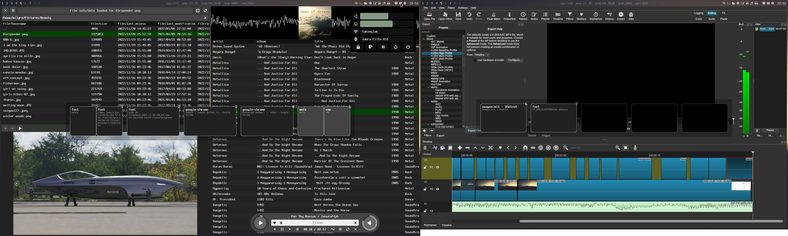

# KineticUI

A modern, minimal ui renderer with html/css based stylimg written in headerless C.

Features :
- MacOS like smooth kinetic animations
- font animatioms
- deterministic session record and replay for automated testing
- gpu or cpu based alpha nblendig
- wayland connector with window and layer support

Usage :

KineticUI is under heavy development, check out projects using KineticUI to see how to use it :

https://github.com/milgra/mmfm  
https://github.com/milgra/vmp  
https://github.com/milgra/sov  
https://github.com/milgra/wcp  

Tips :

Always assert after GETV to make sure html really contains the wanted view.

Roadmap :

- drag between slider bad dirty rect
- error handling in mt core functions ( add, del, rel, expand, etc should return with int)
- example projects, test app
- increase fault tolerance of css and html parser
- increase standards compatibility of css and html (type=button, blocks=true non standard stuff)
- figure out how to use dirty rects with double buffering in ku_renderer_egl
- update software renderer, cut out dirty rect, implement image zoom
- test dirty rect handling
- predictable screenshot when video playing
- use hold gesture during scrolling
- solve last column resize problem
- select/copy/paste in textfields
- vh_textinput should seamlessly switch between texture paragraph and glpyh-based paragraph
